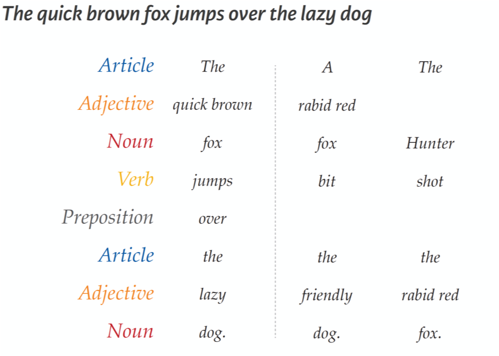
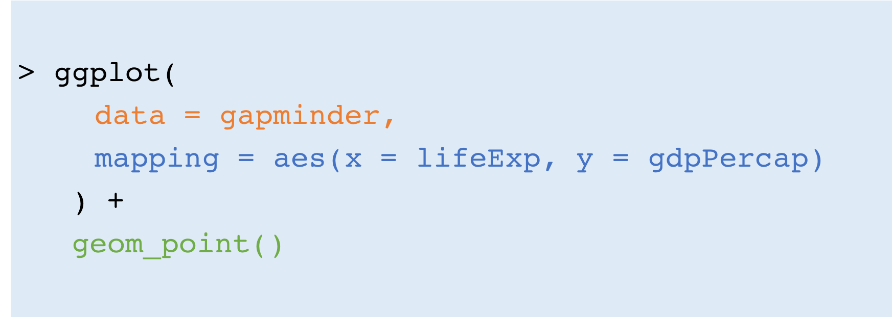
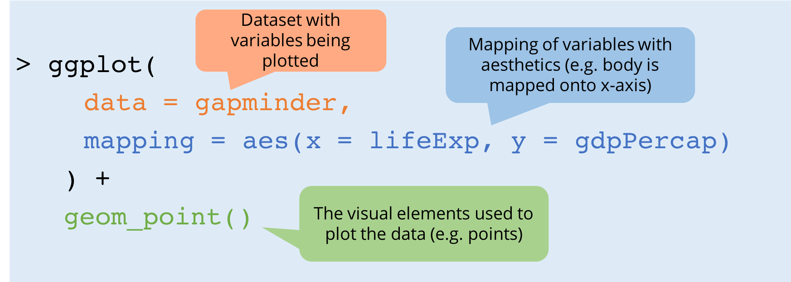

  

<link rel="stylesheet" href="https://use.fontawesome.com/releases/v5.2.0/css/all.css" integrity="sha384-hWVjflwFxL6sNzntih27bfxkr27PmbbK/iSvJ+a4+0owXq79v+lsFkW54bOGbiDQ" crossorigin="anonymous">

---

class: center, middle

# Why is visualisation important?

```{r setup, include=FALSE}
options(htmltools.dir.version = FALSE)
knitr::opts_chunk$set(cache = TRUE, echo = FALSE, warning = FALSE, message = FALSE, fig.width = 8, fig.height = 5, fig.retina = 2)

library(tidyverse)
gapminder <- read_csv("data/gapminder.csv")
```

```{r anscombe-base}
tidy_anscombe <- readr::read_csv("data/tidy-anscombe.csv")

# base plot
plot_anscombe <- function(grp = "Linear Trend") {
 tidy_anscombe %>% 
  filter(group == grp) %>% 
  ggplot(aes(x = x, y = y)) +
  theme_classic() +
  scale_y_continuous(limits = c(0, 20)) +
  scale_x_continuous(limits = c(0, 20)) +
  coord_equal() +
  theme(axis.title = element_blank())
}

```

```{r}
plot_anscombe() +
  geom_smooth(method = "lm", se = FALSE, col = "red", fullrange = TRUE)
```

---

class: middle, center

# Why is visualisation important?


```{r}
plot_anscombe(grp = "Quadratic") +
  geom_point() + 
  geom_smooth(method = "lm", se = FALSE, col = "red", fullrange = TRUE)
```
---

class: middle, center

# Why is visualisation important?

```{r}
plot_anscombe(grp = "Konstant X with influencial Outlier") +
  geom_smooth(method = "lm", se = FALSE, col = "red", fullrange = TRUE) +
  geom_point()
```

---

class: middle, center

# Why is visualisation important?

```{r}
plot_anscombe(grp = "Linear with influencial Outlier") +
  geom_point() + 
  geom_smooth(method = "lm", se = FALSE, col = "red", fullrange = TRUE)
```

---

class: middle, center

# Why is visualisation important?

```{r}
plot_anscombe(grp = "Linear Trend") +
  geom_point() + 
  geom_smooth(method = "lm", se = FALSE, col = "red", fullrange = TRUE)
```

---

class: middle, center

# Why is visualisation important?

```{r}
plot_anscombe(grp = "Linear Trend") +
  geom_point() + 
  geom_smooth(method = "lm", se = FALSE, col = "red", fullrange = TRUE)
```

---
class: center, middle

  .very-large[.red[gg]plot]

</br>

.very-large[.red[G]rammar] 

.very-large[of]

.very-large[.red[G]raphics]  

---
# Analogy - Written Grammar 

.pull-left[
```{r, echo = FALSE, fig.align='center'}

```
]
  
.pull-right[

- Grammar of Graphics

  - Plotting **Framework**
  
  - Leland Wilkinson, 1999
  
- 2 Principles

  - Graphics: Distinct layers of grammatical elements (like adjectives and nouns)
   
  - Meaningful plots through aesthetic mapping (Grammatical rules how to ensemble the ”vocabulary”)
]

---

class: middle, center

# Overview of Grammatical Elements

Element | Description
------------- | -------------
.small-code[.code-orange[Data]]  | The dataset being plotted
.small-code[.code-green[Aestetics]]  | The visual elements used for our data
.small-code[.code-blue[Geometrics]]  | The scales onto which we map our data
.small-code[Facet] | Plotting small multiples
.small-code[Statistic] | Representations of our data to aid understanding
.small-code[Coordinates] | The space on which the data will be plotted
.small-code[Themes] | All non-data ink

---

class: middle, center

.large-code[**ggplot2**]

Essential grammatical elements

.large-code[.code-orange[data]] .large-code[+] .large-code[.code-green[aesthetics]] .large-code[+] .large-code[.code-blue[geometrics]]

Optional grammatical elements

.large-code[Facet]

.large-code[Statistic]

.large-code[Coordinates]

.large-code[Themes]


---

class: middle, center

# Overview 

.large-code[.code-orange[Data]] | .large-code[+]  | .large-code[.code-blue[aesthetics]] | .large-code[+] | .large-code[.code-green[geometrics]]
------------- | ------|----------|------------|-------------------------
.small-code[.code-orange[Dataframe with variable]] | | .small-code[.code-blue[x-Axis]] | | .small-code[.code-green[Point]]
.small-code[.code-orange[of interest]] | | .small-code[.code-blue[y-Axis]] | | .small-code[.code-green[Line]]
 | | .small-code[.code-blue[Color]] | | .small-code[.code-green[Histogram]]
 | | .small-code[.code-blue[Size]] | | .small-code[.code-green[Boxplot]]
 | | .small-code[.code-blue[Shape]] | | .small-code[.code-green[...]]
 | | .small-code[.code-blue[Fill]] | | .small-code[.code-green[]]
 | | .small-code[.code-blue[...]] | | .small-code[.code-green[]]

---

# How to speak with the Grammar of Graphics

## ggplot Syntax



---

# How to speak with the Grammar of Graphics

## ggplot Syntax



---

# Scatterplot

```{r eval = FALSE, echo=TRUE}
ggplot(data = gapminder, 
       mapping = aes(x = lifeExp, y = gdpPercap)) +
  geom_point()

```
    
.center[
```{r echo = FALSE}
gapminder <- read_csv("data/gapminder.csv") %>% filter(year == 2007)

ggplot(data = gapminder, 
       mapping = aes(x = lifeExp, y = gdpPercap)) +
  geom_point()
```
]

---

# Scatterplot - adding further .code-green[aesthetics]
```{r, eval = FALSE, echo=TRUE}

ggplot(data = gapminder, 
       mapping = aes(x = lifeExp, y = gdpPercap, color = continent)) +
  geom_point()
```
    
.center[
```{r echo = FALSE}

ggplot(data = gapminder, 
       mapping = aes(x = lifeExp, y = gdpPercap, color = continent)) +
  geom_point()
```
]

---

# Scatterplot - adding further .code-green[aesthetics]
```{r eval = FALSE, echo=TRUE}

ggplot(data = gapminder, 
       mapping = aes(x = lifeExp, y = gdpPercap, color = continent, size = pop)) +
  geom_point()
```
    
.center[
```{r echo = FALSE}

ggplot(data = gapminder, 
       mapping = aes(x = lifeExp, y = gdpPercap, color = continent, size = pop)) +
  geom_point()
```
]

---

# Barplots

```{r  eval=FALSE, echo=TRUE}

ggplot(data = gapminder,
       mapping = aes(x = continent, fill = lifeExp_cat)) +
  geom_bar() 

```
    
.center[
```{r echo = FALSE}

ggplot(data = gapminder,
       mapping = aes(x = continent, fill = lifeExp_cat)) +
  geom_bar()

```
]

---

# Boxplots

```{r  eval=TRUE, echo=TRUE}

ggplot(data = gapminder,
       mapping = aes(x = continent, y = lifeExp)) +
  geom_errorbar(stat = "boxplot") +
  geom_boxplot() 

```

---

# Histogramm und Density Plots

.pull-left[
```{r eval=FALSE, echo=TRUE}
gapminder %>% 
  ggplot(mapping = aes(x = lifeExp)
  geom_histogram()
```
]

.pull-right[
```{r}
gapminder %>% 
  ggplot(mapping = aes(x = lifeExp)) +
  geom_histogram()

```
]

---

# Histogramm und Density Plots

.pull-left[
```{r eval=FALSE, echo=TRUE}
gapminder %>% 
  ggplot(mapping = aes(x = lifeExp, 
                       {{fill=continent)) +}}
  geom_histogram() +
  {{viridis::scale_fill_viridis(discrete = T)}} +
  {{theme_minimal()}}
```
]

.pull-right[
```{r}
gapminder %>% 
  ggplot(mapping = aes(x = lifeExp, fill = continent)) +
  geom_histogram() +
  viridis::scale_fill_viridis(discrete = TRUE) +
  theme_minimal()

```
]

---
background-image: url(img/ignaz_semmelweis_1860.jpeg)
background-size: 200px
background-position: 95% 30%


# Timeline Data

.pull-left-wide[
Diese Zeitreihenanalyse basiert auf Daten von Igantz Semmelweis aus den Jahren 1841 bis 1849.
Semmelweis beobachtete die Kindersterblichkeit in mehreren Kliniken.
Dabei bemerkte er einen Zusammenhang zwischen den Hygiengebedingungen einzelner Kliniken und deren Mortalitätsrate Neugeborener.
Je besser die Hygiene der Arzte war, insbesondere durch das Händewaschen vor dem Kontakt mit den Neugeborenen, desto geringer war die Mortalität.

Seine Beobachtungen veröffentlichte Semmelweis in Tabellen und teilte seine Schlussfolgerungen in einem offenem Brief seinen Kollegen mit.
Diese ignorierten jedoch seine Anweisungen. 

Die Datenvisualisierung war zu dieser Zeit noch unüblich.
Möglicherweise wären seine Beobachtungen von den Kollegen eher wahrgenommen worden, wenn diese zusammenfassend in einer Zeitreihenanalyse dargestellt worden wären.
]


```{r fig.height=4, fig.width=12, fig.retina=2, echo = FALSE}

library(tidyverse)
handwashing_start = as.Date('1847-06-01')

read_csv("data/monthly_deaths.csv") %>% 
  group_by(date = lubridate::floor_date(date, "quarter")) %>% 
  summarise(deaths = sum(deaths), births = sum(births)) %>% 
  mutate(p_deaths = deaths / births) %>% 
  mutate(handwashing_started = date >= handwashing_start) %>% 
  ggplot(aes(x = date, y = p_deaths, color = handwashing_started)) +
  geom_line() +
  geom_point() +
  geom_vline(xintercept = handwashing_start, linetype = 2, color = "grey") + 
  annotate(label = "Händewaschen eingeführt",
           geom  = "text",
           x = handwashing_start,
           angle = 90,
           y = .13,
           vjust = 2,
           family = "Times",
           size = 5,
           color = "black") +
  theme_minimal() +
  scale_y_continuous("Anteil gestorbener Neugeborener", labels = scales::percent, breaks = seq(0, .25, by = .05)) +
  scale_x_date("Jahr", date_labels = "%Y", breaks = seq.Date(as.Date("1841-01-01"), as.Date("1849-01-01"), by = "years")) +
  scale_color_brewer(palette = "Set1") +
  guides(col = FALSE) +
  theme(text = element_text(family = "Times", size = 16))

```

---

class: middle, center

# Publication Ready Plots

```{r}
MASS::mammals %>% 
  ggplot(aes(x = body, y = brain)) +
  geom_point(alpha = 0.6) +
  stat_smooth(method = "lm", col = "red", se = FALSE)
```

---

class: middle, center

# Publication Ready Plots

```{r echo=FALSE, fig.width=6, fig.height=6}
library(scales)

MASS::mammals %>% 
  ggplot(aes(x = body, y = brain)) +
  geom_point(alpha = .6) +
  geom_smooth(method = "lm", se = FALSE, col = "red") +
  scale_x_log10(expression("Body weight (log"["10"]*"(Kg))"),
                breaks = trans_breaks("log10", function(x) 10^x),
                labels = trans_format("log10", math_format(10^.x))) +
  scale_y_log10(expression("Brain weight (log"["10"]*"(g))"),
                breaks = trans_breaks("log10", function(x) 10^x),
                labels = trans_format("log10", math_format(10^.x))) +
  annotation_logticks() +
  theme_classic() +
  coord_fixed(xlim = c(1e-3, 1e4), ylim = c(1e-1, 1e4)) +
  theme(text = element_text(family = "Times"))

```


---

class:  middle center
background-image: url(../img/logo-hs-os-kompakt.jpg)


# Kontakt 

|                                                                                                            |                 |
| :--------------------------------------------------------------------------------------------------------- | :---------------|
| <a href="mailto:j.huesers@hs-osnabrueck.de">.black[<i class="fas fa-envelope"></i>]   | j.huesers@hs-osnabrueck.de     |
| <a href="">.black[<i class="fa fa-link fa-fw"></i>]                                           | sciphy-stats.com                     |
| <a href="">.black[<i class="fab fa-twitter"></i>]                                        | @jnshsrs                       |
| <a href="http://github.com/jnshsrs">.black[<i class="fab fa-github"></i>]                | @jnshsrs                       |

